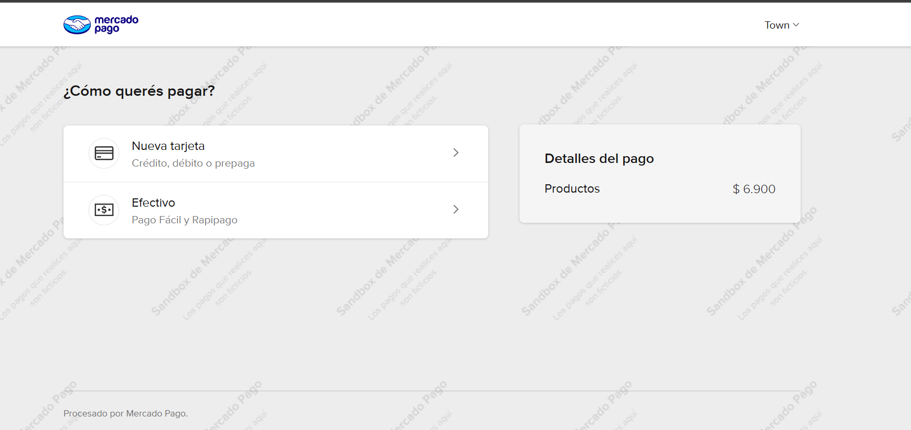
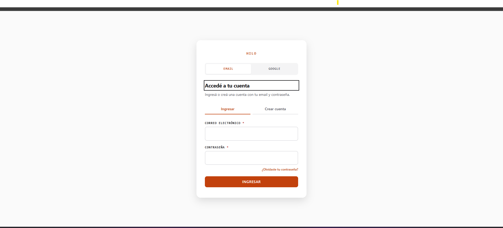
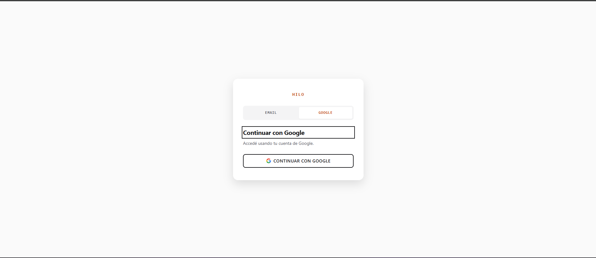

# HILO Store — ecommerce de medias hecho con agentes de IA

Ecommerce completo (catálogo, login, carrito, checkout, pagos y panel de
administración) **diseñado, construido y testeado por un equipo de agentes de
IA** coordinados con [Claude Code](https://claude.com/claude-code). Es un
proyecto de prueba: el foco está en cómo se resuelven los problemas reales de un
ecommerce (dinero, stock, sesiones, pagos) y en cómo se organiza el trabajo de
varios agentes especializados.

## Capturas

| Catálogo | Carrito |
| --- | --- |
|  |  |

| Pago con Mercado Pago (sandbox) | Login |
| --- | --- |
|  |  |



## Qué incluye

- **Catálogo** renderizado en el cliente desde un JSON que genera un script a
  partir de la base, sin product cards escritas a mano.
- **Login** con email/contraseña y Google (React + Vite). Los métodos se
  activan o apagan por configuración.
- **Carrito** persistente, independiente de la sesión.
- **Checkout** con envío a domicilio (costo por provincia) o retiro, y pago por
  **transferencia** (con comprobante) o **Mercado Pago**.
- **Panel interno** para revisar y confirmar comprobantes de transferencia.
- **Backend** Node/Express con **SQLite** y migraciones versionadas.

## Cómo se construyó: un equipo de agentes

Cada agente tenía un rol y un alcance definidos, y un orquestador planificaba
por etapas, delegaba y revisaba lo que devolvía cada uno:

| Rol | Responsabilidad |
| --- | --- |
| Orquestación | Plan por etapas, integración entre agentes, decisiones de arquitectura |
| Backend y base de datos | Modelo de datos, migraciones, API |
| Desarrollo | Features, correcciones y tests |
| Diseño UX/UI | Sistema de diseño, componentes, accesibilidad |
| Datos | Scraping y ETL del catálogo |
| QA adversarial | Prueba flujos con datos límite, doble click, bypasses y entradas maliciosas |

Las decisiones de arquitectura y los contratos entre agentes se documentaban a
medida que se tomaban, para que cada agente (y cada sesión nueva) retomara con
el contexto completo.

## Decisiones técnicas destacadas

- **El servidor manda con el dinero.** El cliente solo envía `[{producto,
  cantidad}]`: el servidor lee precios y stock en el momento y recalcula todo.
  Importes en centavos enteros (nunca floats) y cotejo del precio que vio el
  cliente contra el vigente.
- **Pedidos idempotentes y atómicos.** Una clave por intento evita duplicados por
  doble click o reintento de red, y el pedido con sus ítems se crea en una
  única transacción.
- **QA adversarial con impacto real.** Una pasada de QA encontró que el stock y
  el tope de cantidad se validaban línea por línea y se podían evadir repitiendo
  el mismo producto en varias líneas. Se corrigió agregando por producto en el
  servidor y se dejó cubierto con tests de regresión.
- **Sesión segura.** Cookie `HttpOnly`, nunca `localStorage`. En Google se verifica
  la firma del ID token y no se vincula una cuenta existente si el email no está
  verificado.
- **Pagos.** Con Mercado Pago (Checkout Pro), el webhook valida la firma HMAC,
  vuelve a consultar el pago a la API y coteja el monto antes de marcar el pedido
  como pagado. Con transferencia, el comprobante se valida por su contenido real
  (magic bytes, no por lo que declara el cliente), nunca se sirve como archivo
  público y solo lo ve el dueño del pedido o el administrador.
- **Base de datos.** Migraciones que nunca se reescriben (siempre una nueva) y
  restricciones en el esquema (`CHECK`, `UNIQUE`) además de las del código.

## Stack

HTML/CSS/JS vanilla (home, catálogo, carrito, checkout) · React + Vite (login) ·
Node.js + Express · SQLite (`better-sqlite3`) · Mercado Pago SDK · Google
Identity Services · tests con el runner nativo de Node (`node --test`).

## Correrlo en local

Requisitos: Node 20+ y Python 3.

```bash
# 1. Dependencias y build del login
cd server && npm install
cd ../frontend && npm install && npm run build

# 2. Variables de entorno: copiar .env.example a .env en server/ y en frontend/

# 3. Base de datos (crea el esquema)
python db/scripts/run_migrations.py

# 4. Servidor: sitio, login, checkout y API en http://localhost:4000
cd server && npm run dev
```

La base de datos y las fotos de producto no están en el repo; las migraciones
crean el esquema y `db/scripts/` tiene los seeds de precios y tarifas de envío.
Sin credenciales de Mercado Pago, transferencia, email o SMS la app arranca
igual y esos métodos quedan "en configuración". Los tests corren con
`cd server && npm test`.

## Estado y próximos pasos

- Mercado Pago está probado en sandbox hasta la pantalla de pago; para probar el
  webhook de punta a punta hace falta una URL pública.
- Los precios y las tarifas de envío son de prueba.
- Pendiente: email transaccional (recuperación de contraseña y avisos de pedido) y
  migrar todo el sitio a React.
